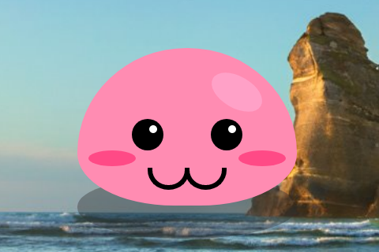

# Use Layered Style Form

[[Home](README.md)]

Specify the property value `Layered` for the `WindowType` of the Formium form to set the form style to the alien style. The alien style uses CEF's off-screen rendering technology to draw the off-screen rendered image onto the LayeredWindow through Direct2D.

```csharp
public override HostWindowType WindowType => HostWindowType.Layered;
```

Because off-screen rendering cannot call GPU for graphics acceleration, the smoothness of rendering is not as smooth as that of non-off-screen rendering, and this mode cannot use WebGL to draw complex graphics.

Shaped style windows cannot change the size of the window at runtime, so you should plan the size of the window before starting the window and use the `Size` property to specify the size of the window.

In addition, you can set the transparent or semi-transparent area according to the elements in the web page to achieve the special-shaped (fully transparent) and semi-transparent effects.



As shown in the example above, the background color `background-color` of the page where the cartoon character is located is set to `transparent` to realize the drawing of the special-shaped form (the transparent area can be penetrated by mouse click); the shadow part of the cartoon is set to `background-color` It is a semi-transparent black of `rgba(0,0,0,.7)`, this area is rendered as a semi-transparent effect (the semi-transparent area cannot be penetrated by mouse clicking)

Transparent area

```CSS
body {
  ...
  background: transparent;
  ...
}
```

Translucent area

```CSS
.shadow {
  ...
  background: #2f2f2f60;
  ...
}
```
