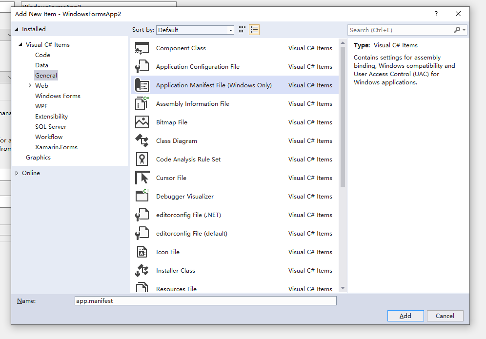
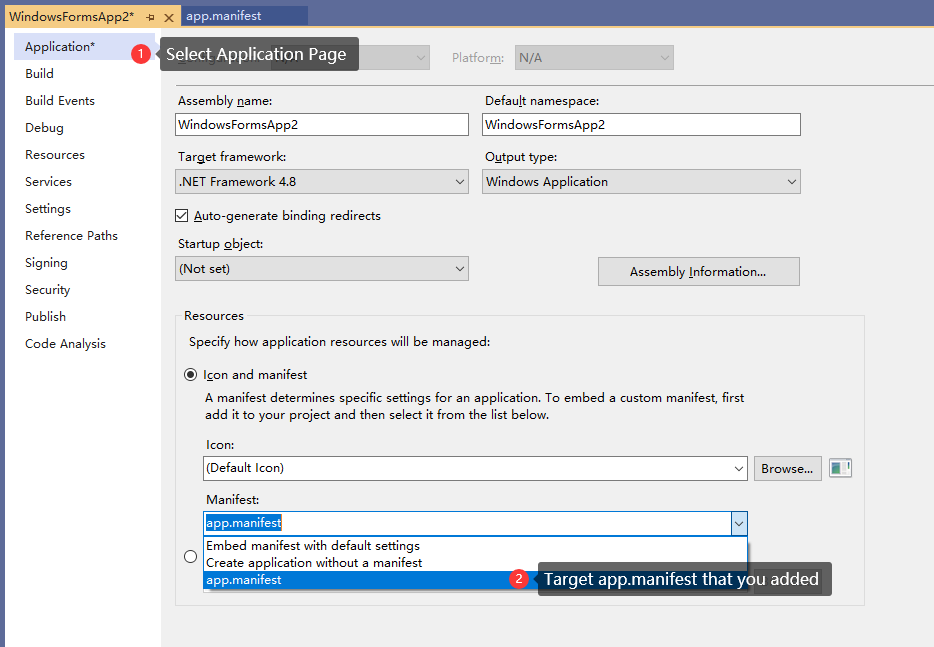

# 在高分屏下画面出现撕裂或重影

[[返回目录](../README.md)]

当 Windows 在高分辨率显示器（如 2K、4K 显示器）下启用了自定义缩放级别（Win10：设置->系统->显示->缩放与布局->更改文本、应用等项目的大小）时，运行 NanUI 应用程序可能会看到如下画面，出现大小不同的重叠界面，有时还会不停闪烁。

**注意**： NanUI 0.8 版因添加了特定的处理过程，已不会发生此问题。您会看到的可能是现图像模糊，要处理图像模糊的问题，方法跟下述一致。


那么，您需要手动添加应用程序清单文件 app.manifest，并且在项目属性的页面的 Application 选项卡中选择您手动添加的这个清单文件。





取消 app.manifest 文件中关于 HighDPI 支持段落的注释。

```xml
<application xmlns="urn:schemas-microsoft-com:asm.v3">
    <windowsSettings>
        <dpiAware xmlns="http://schemas.microsoft.com/SMI/2005/WindowsSettings">true</dpiAware>
    </windowsSettings>
</application>
```

如果您想启用多显示器不同 DPI 级别的缩放（Windows 8.1 或更高版本系统支持），您还需要加上以下代码。

```xml
<application xmlns="urn:schemas-microsoft-com:asm.v3">
    <windowsSettings>
        ...
        <dpiAwareness xmlns="http://schemas.microsoft.com/SMI/2016/WindowsSettings">PerMonitor</dpiAwareness>
    </windowsSettings>
</application>
```

如果您想启用多显示器不同 DPI 级别的拖动缩放特性（Windows 10 创意者更新或更高版本），那么请把上面的代码更改为下面的参数。

```xml
<application xmlns="urn:schemas-microsoft-com:asm.v3">
    <windowsSettings>
        <dpiAware xmlns="http://schemas.microsoft.com/SMI/2005/WindowsSettings">true</dpiAware>
        <dpiAwareness xmlns="http://schemas.microsoft.com/SMI/2016/WindowsSettings">PerMonitorV2</dpiAwareness>
    </windowsSettings>
</application>
```

如果您的应用程序基于 .NET CORE 3.1 框架，那么您不用使用上述步骤，直接在 Main 方法种添加下述代码即可。

```csharp
static void Main()
{
    Application.SetHighDpiMode(HighDpiMode.PerMonitorV2);
    // ...
}
```
