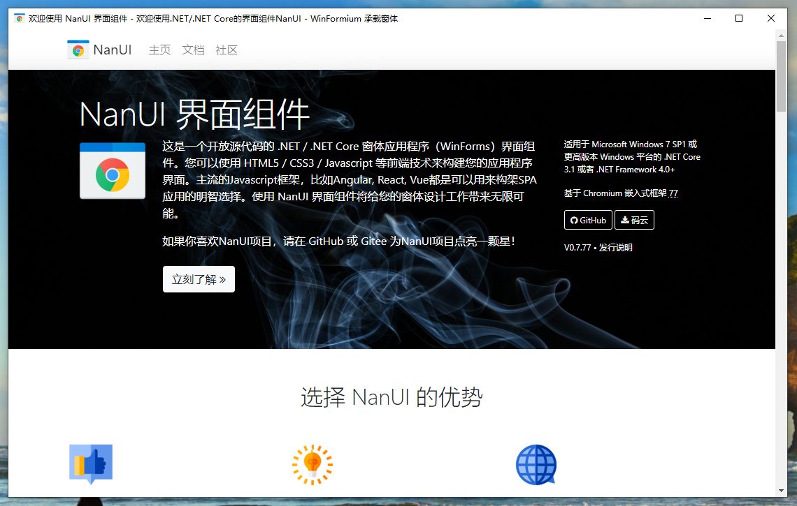

# NanUI 窗体

[[返回目录](README.md)]

**Formium** 取名源自于 WinForms 编程中的 `Form` 以及 `Chromium` 中的`ium`。顾名思义就是`WinForms`与`Chromium`的结合,`Form`+`ium`=`Formium`。

Formium 包装了`System.Window.Forms.Form`的窗体大多数，并且结合 CEF 框架，目标是给 NanUI 用户带来与 WinForms 相同的开发体验。

- [NanUI 窗体](#nanui-窗体)
  - [初始化 Formium](#初始化-formium)
  - [设置窗体相关属性](#设置窗体相关属性)
  - [设置浏览器相关属性](#设置浏览器相关属性)
  - [窗体样式](#窗体样式)
  - [使用 NanUI 内置命令](#使用-nanui-内置命令)

## 初始化 Formium

创建一个类继承抽象类`Formium`并实现抽象属性`WindowType`和`StartUrl`。通常称这个类为`Formium 窗体类`。

```csharp
using NetDimension.NanUI;
using NetDimension.NanUI.HostWindow;

class SimpleWindow : Formium
{
    public override HostWindowType WindowType { get; }
    public override string StartUrl { get; }
}

```

使用`WindowType`来设置窗体呈现样式。如下所示，可以指定窗体样式为无边框样式。

```csharp
public override HostWindowType WindowType => HostWindowType.Borderless;
```

使用`StartUrl`来指定浏览器起始页面的 URL 地址。

```csharp
public override string StartUrl => "https://example.com";
```

## 设置窗体相关属性

在 WinForm 开发中，您需要在构造函数中来创建子控件，并为子控件设置各项属性来绘制窗体和内容（通常这个工作是由可视化的窗体设计器完成的）。NanUI 的窗体 Formium 中没有子控件这一说法，因为绘制界面的工作完全交给了浏览器，所以您不需要在构造函数中创建子控件，但是您还是需要给窗体本身设置属性。在 Formium 中仅公开了常用的窗体属性、事件和方法，您并不能直接操控原来的 Form 组件，这样设计是为了避免各种因直接修改 Form 的相关内容而造成的不必要的问题。

在 Formium 的构造函数中，您可以使用 Form 原本常用的属性和方法以及 Formium 特有的属性和方法。在 Formium 中与窗体设置有关的属性及方法可以查阅[窗体相关成员](nanui-formium-winform-members.md)章节了解更多信息。

## 设置浏览器相关属性

在 Formium 中重载 OnReady 方法，您可以在该方法中对浏览器相关的内容进行设置，这些内容包括了浏览器的基础属性和各种事件的处理。具体的属性、方法及事件请查阅[浏览器相关成员](nanui-formium-browser-members.md)查看更多信息。

## 窗体样式

目前`Formium`的`WindowType`支持 5 中特定样式：`System`、`Borderless`、`Kiosk`、`Layered`和`Acrylic`：

- **System**：系统原生窗体样式。

  系统原生窗体样式与传统的 WinForm 应用程序界面一致，拥有系统样式的标题栏、边框和系统命令区域，类似在传统的 Form 控件上拖入 WebBrowser 控件并设置 Dock 属性为 Fill 时的样子一致。

  

  要了解更多有关于`System`窗口类型的系统，请参考[使用原生样式窗体](using-system-style-window.md)章节。

- **Borderless**：无边框窗体样式。

  在无边框窗体样式中系统原生的标题栏和边框被隐藏，您可以使用整个窗体区域来绘制您的应用程序界面。Borderless 模式提供了多种窗体投影效果以及色彩设置，还提供了`BorderLine`、`Rounded`和`None`三种边框样式可供选择。

  

  要了解更多有关于`Borderless`窗口类型的系统，请参考[使用无边框样式窗体](using-borderless-style-window.md)章节。

- **Kiosk**：Kiosk 模式样式。

  Kiosk 样式的窗体普遍用于需要全屏展示窗体内容的场景，例如：工控上位机界面、查询机界面、数据大屏幕等。
  要了解更多有关于`Kiosk`窗口类型的系统，请参考[使用 Kiosk 样式窗体](using-kiosk-style-window.md)章节。

- **Layered**：异形窗口样式。

  使用 Layered 样式允许您创建异形、半透明窗体。需要注意的是异形窗口不提供实时改变窗体大小的选项。根据网页中透明或者半透明区域的设置，即可实现异形和半透明效果。

  

  要了解更多有关于`Layered`窗口类型的系统，请参考[使用异形样式窗体](using-layered-style-window.md)章节。

- **Acrylic**：亚克力特效窗体样式。

  亚克力特效是 Windows 10 创意者更新版之后提供的新功能，它允许窗体的透明或半透明区域与桌面元素进行模糊混合，实现特殊的磨砂亚克力效果。与 Layered 样式相同，根据网页中透明或者半透明区域的设置，将实现特定效果的磨砂玻璃效果。

  

  要了解更多有关于`Acrylic`窗口类型的系统，请参考[使用 Win10 亚克力特效样式窗体](using-acrylic-style-window.md)章节。

## 使用 NanUI 内置命令

Formium 窗体在前端环境中内置了 html 属性`formium-command`以及 JavaScript 上下文中的`Formium`对象。

**formium-command 属性**

用户点击具有`formium-command`属性的 HTML 元素时可以实现的最大化、最小化、还原及关闭命令。

例如设置 formium-command="close"可以实现点击该元素后关闭窗体。

```html
<button formium-command="close">关闭窗口</button>
```

目前提供有如下几个 formium-command 属性的值：

| 属性名   | 命令作用     |
| :------- | :----------- |
| maximize | 最大化窗口   |
| minimize | 最小化窗口   |
| restore  | 还原窗口     |
| close    | 关闭当前窗口 |

**Formium 对象**

NanUI 在 Chromium 的 Javascript 环境中注册了`Formium`对象。通过该对象您能够获取当前窗体的相关信息，或者使用内置的函数来改变窗体的各项状态。

- **Formium**

  - get _culture_ `string`

    获取当前应用程序的语言设置。例如：`zh-CN`。

  - _onReady_ `(calllback:function) => void`

    当 DOM 加载完成（不包括资源）时，执行回调函数`callback`。

  - _onContextReady_ `(calllback:function) => void`

    当 Formium 上下文准备好时，执行回调函数`callback`。

  - **hostWindow** `object`

    - _minimize_ `() => void`

      最小化窗体。

    - _maximize_ `() => void`

      最大化窗体。

    - _close_ `() => void`

      关闭当前窗体。

    - _restore_ `() => void`

      恢复当前窗体。

    - _fullScreen_ `() => void`

      是当前窗体全屏化。

    - _moveTo_ `(x:int, y:int) => void`

      移动当前窗体到屏幕`x`和`y`坐标的位置。

    - _sizeTo_ `(width:int, height:int) => void`

      改变窗体的大小为`width`\*`height`。

    - _getWindowState_ `() => string`

      获取当前窗体的状态。返回值为其中之一：`normal`，`minimized`和`maximized`。

    - _getWindowRectangle_ `() => {x:int, y:int, width:int, height:int}`

      获取当前窗体的坐标和尺寸。

    - _active_ `() => void`

      激活当前窗口。

  - **network** `object`

    - _isNetworkAvailable_ `() => bool`

      测试当前网络连接状态。网络可用时返回 true，否则返回 false。

  - **version** `object`

    - get _formium_ `string`

      获取当前 NanUI 的版本。

    - get _chromium_ `string`

      获取当前 Chromium 的版本。

  - **external** `object`

    通过`RegisterExternalObjectValue`方法注册的对象都包括在此对象集合中。通过使用`Formium.external.XXX`来调用您注册的对象及其包含的属性和方法（其中`XXX`为注册对象的名称）。

**浏览器中的自定义事件**

NanUI 除了在 Chromium 的 JavaScript 环境中注册了对象以外，还注册了一些承载窗体改变的通知事件。您可以通过注册事件句柄来捕获这些事件，以此来实现各项功能。

**hostactivated**

窗体获得焦点并被激活。

**hostdeactivate**

窗体失去焦点。

**hostactivatestatechange**

窗体焦点状态改变

参数

- _actived:`bool`_：激活状态[true:获得焦点|false:失去焦点]。

**hoststatechanged**

窗体最大化最小化状态改变

参数

- _state:`string`_：状态名称[normal|minimized|maximized]。

**hostsizechanged**

窗体尺寸大小改变。

参数

- _width:`int`_：宽度。
- _height:`int`_：高度。

例如，我们可以通过捕获承载窗体最大化最小化状态改变的事件来为窗体添加不同的样式：

```javascript
window.addEventListener("hoststatechanged", (e) => {
  if (e.detail.state === "maximized") {
    console.log("窗口被最大化了");
  } else if (e.state === "minimized") {
    console.log("窗口被最小化了");
  } else {
    console.log("正常状态");
  }
});
```

**表示窗体状态的 CSS 属性**

Formium 窗体在不同的状态时会向 DOM 的根标签 html 添加一些 class 名称来方便编写前端页面 CSS 时为特定状态设置效果。目前包括了以下几个特殊的内置 class 名称：

- **formium-focus**

  当前窗体处于激活状态时，html 标签具备名为`formium-focus`的 class 名称。

- **formium-blur**

  当前窗体处于后台状态时，html 标签具备名为`formium-blur`的 class 名称。

- **formium-maximized**

  当前窗体处于最大化时，html 标签具备名为`formium-maximized`的 class 名称。

例如，需要在窗体处于激活和非激活状态时，为某 DOM 元素指定不同的样式:

**Html**

```html
<div class="my-div">Hello NanUI!</div>
```

**CSS**

```css
html.formium-focus .my-div {
  background-color: #red;
  color: white;
}

html.formium-blur .my-div {
  background-color: #gray;
  color: black;
}
```
