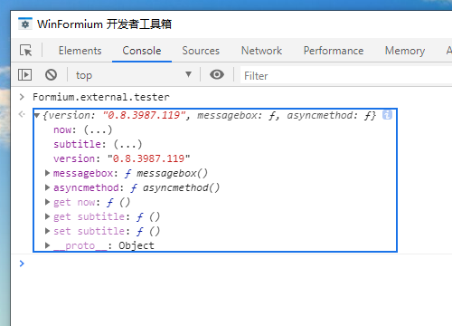
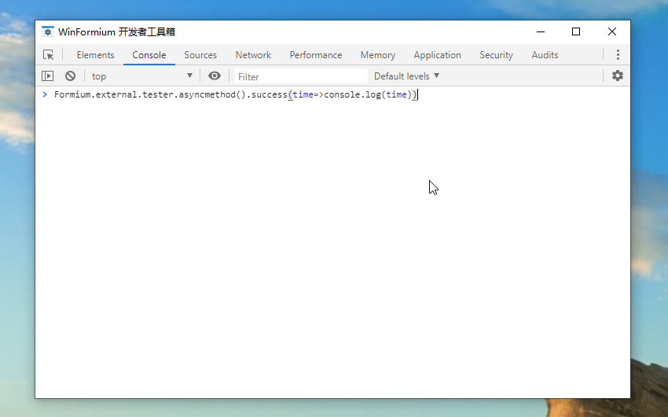

# 注册 JavaScript 对象

[[返回目录](README.md)]

- [注册 JavaScript 对象](#注册-javascript-对象)
  - [创建对象](#创建对象)
  - [注册对象](#注册对象)
  - [调用](#调用)

很多情况下需要向 JavaScript 环境中注册 .NET 相关对象以扩展 NanUI 应用程序的功能，NanUI 提供了这种能力。使用`JavaScriptValue`创建对象并绑定 .NET 对象的映射，之后使用 Formium 窗体的`RegisterExternalObjectValue`方法把`JavaScriptValue`创建的对象注册到前端页面 JavaScript 环境的`Formium.external`对象中。

## 创建对象

使用 JavaScriptValue 创建对象，可以为 JavaScriptValue 对象添加`属性`，`值`，`同步方法`，`异步方法`这几种数据类型。具体请看以下示例。

```csharp
var obj = JavaScriptValue.CreateObject();

//注册只读属性
obj.SetValue("now", JavaScriptValue.CreateProperty(() =>
{
    return JavaScriptValue.CreateDateTime(DateTime.Now);
}));

//注册值
obj.SetValue("version", JavaScriptValue.CreateString(Assembly.GetExecutingAssembly().GetName().Version?.ToString()));

//注册可读写属性
obj.SetValue("subtitle", JavaScriptValue.CreateProperty(() => JavaScriptValue.CreateString(Subtitle), title => Subtitle = title.GetString()));

//注册同步方法
obj.SetValue("messagebox", JavaScriptValue.CreateFunction(args =>
{
  var msg = args.FirstOrDefault(x => x.IsString);

  var text = msg?.GetString();

  InvokeIfRequired(() =>
  {
      MessageBox.Show(HostWindow, text, "Message from JS", MessageBoxButtons.OK, MessageBoxIcon.Information);
  });

  return JavaScriptValue.CreateString(text);
}));

//注册异步方法
obj.SetValue("asyncmethod", JavaScriptValue.CreateFunction((args, callback) =>
{
  Task.Run(async () =>
  {
    var rnd = new Random(DateTime.Now.Millisecond);

    var rndValue = rnd.Next(3000, 6000);

    await Task.Delay(rndValue);
    callback.Success(JavaScriptValue.CreateString($"Delayed {rndValue} milliseconds"));
  });
}));
```

## 注册对象

然后将这个对象注册到 JavaScript 环境的`Formium.external`里，并取名`tester`。

```csharp
RegisterExternalObjectValue("tester", obj);
```

## 调用

注册成功后即可在前端环境中调用已注册的对象，实现数据交换以及方法调用等。



调用 tester 对象的只读属性 now。

```console
> Formium.external.tester.now
< Thu Oct 29 2020 23:12:19 GMT+0800 (中国标准时间)
```

测试异步方法


