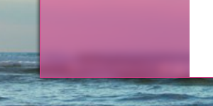
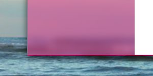

# 使用 Win10 亚克力特效样式窗体

[[返回目录](README.md)] [[返回正文](nanui-formium.md#窗体样式)]

亚克力特效是 Windows 10 创意者更新版之后提供的新功能，它允许窗体的透明或半透明区域与桌面元素进行模糊混合，实现特殊的磨砂亚克力效果。

```csharp
public override HostWindowType WindowType => HostWindowType.Acrylic;
```

亚克力特效使用 CEF 的离屏渲染技术，通过 Direct2D 将离屏渲染的图像绘制到带有亚克力效果的窗体上。

因为离屏渲染无法调用 GPU 进行绘图加速，因此在渲染时流畅度不如非离屏渲染时的流畅度，并且此模式无法使用 WebGL 绘制复杂图形。

与 Layered 样式相同，根据网页中透明或者半透明区域的设置，将实现特定效果的磨砂玻璃效果。


如上图中的示例，边栏部分使用了一个半透明的粉色，透明部分与亚克力部分混合后实现了图上的效果。您也可以指定其他的颜色与之混合或者使用透明颜色来呈现亚克力窗体原本的效果。

## ShadowEffect 阴影效果

Formium 亚克力特效窗的`ShadowEffect`属性体有四种可选的效果：`无阴影`、`光晕`、`阴影`和`投影`。

```csharp
AcrylicWindowProperties.ShadowEffect = ShadowEffect.Shadow;
```

- **None**

  无阴影。关闭 Formium 窗体的阴影效果。

  

- **Glow**

  光晕效果。

  

- **Shadow**

  阴影效果。

  

- **DropShadow**

  投影效果。

  

阴影同样支持设置颜色。设置`ShadowColor`属性来设置窗体激活状态时的阴影颜色；设置`InactiveShadowColor`属性来设置非激活状态时的阴影颜色。`InactiveShadowColor`设置为 NULL 时，NanUI 将自动通过`ShadowColor`的色彩值为 Formium 窗体的阴影计算一个合适的色彩。

```csharp
AcrylicWindowProperties.ShadowEffect = ShadowEffect.DropShadow;
AcrylicWindowProperties.ShadowColor = ColorTranslator.FromHtml("#E83B90");
AcrylicWindowProperties.InactiveShadowColor = Color.FromArgb(125, ColorTranslator.FromHtml("#666666"));
```
